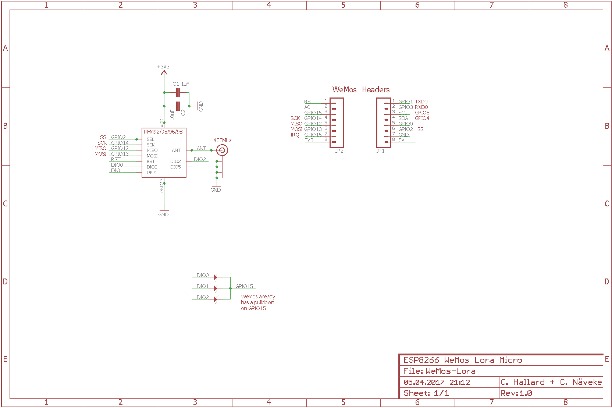
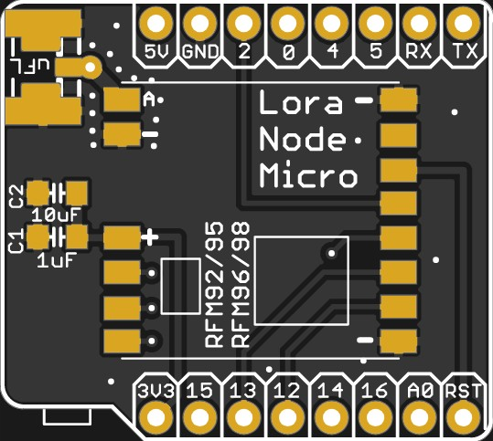
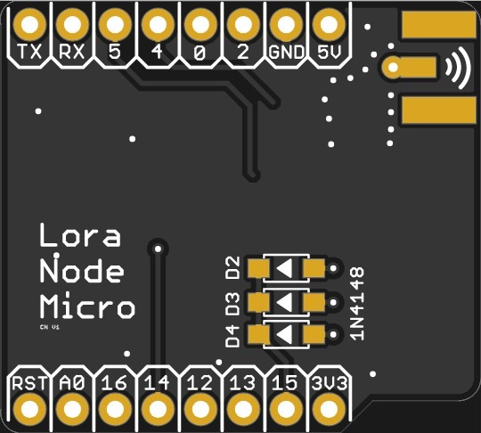
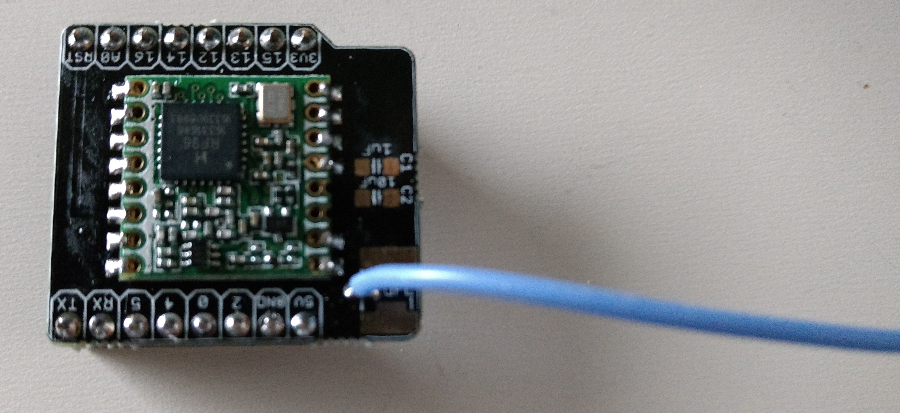
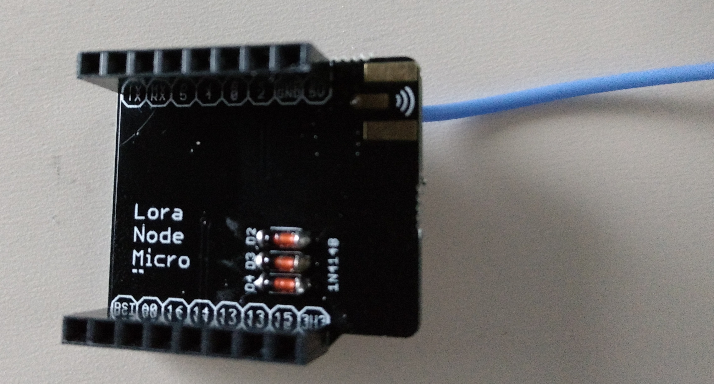

Note: This is a fork from https://github.com/hallard/WeMos-Lora reducing complexity (no display connector, no LEDs, no button) and freeing GPIO16/D0 to allow deep sleep

ESP8266 WeMos Shield for HopeRF RFM95 RFM96 RFM98 Lora Modules
==============================================================

This shield is used to hold HopeRF [Lora module][4] Software with WeMos ESP8266 boards it has just few minimal features. 
- Placement for RFM95/96/98 Lora module
- Placement for choosing single Wire, SMA or u-FL Antenna type 


You can find more information on WeMos on their [site][1], it's really well documented.
I now use WeMos boards instead of NodeMCU's one because they're just smaller, features remains the same, but I also suspect WeMos regulator far better quality than the one used on NodeMCU that are just fake of originals AMS117 3V3.

Boards arrived from OSHPark, I tested them, works fine with forked version of [single Channel LoRaWAN Gateway][5] but you can use any program that is compatible with RFM95 Lora module according it to real pinout.

Detailed Description
====================

Look at the schematics for more informations.

SPI connexion is classic (MOSI/MISO/CLK), Chip Select is connected with GPIO2.

Other pins that may need be adapted into code (for example if you use TTN network gateway code) according to the following pinout

Please not that to avoid 3 GPIOs for DIO0,DIO1,DIO2 Interrupt, these 3 are OR'ed with 3 diodes, respectively named D2,D3 and D4. This permit to use only one IRQ pin (here GPIO15). This is only possible because on IRQ routine the RFM9x IRQ register is read and then software knows which one has been triggered.
You can see more details ont this dedicated LMIC [Pull Request][6]

```
   WeMos D1          RFM9x Module
  GPIO12 (D6) <----> MISO
  GPIO13 (D7) <----> MOSI
  GPIO14 (D5) <----> CLK
  GPIO15 (D8) <----> DIO0/D2 OR DIO1/D3 OR DIO2/D4
  GPIO02 (D4) <----> SEL (Chip Select)
 <----> Push Button
```

### Schematic  
  

### Boards  
  
  

You can order the PCB of this board at [PCBs.io][3] if you do so, PCBs.io give me little discount that allow me to buy some new created boards.

### Assembled boards




##License

http://unlicense.org/

 
[1]: http://www.wemos.cc/wiki/doku.php?id=en:d1_mini
[3]: https://pcbs.io/share/4XG02
[4]: http://www.hoperf.com/rf_transceiver/lora/
[5]: https://github.com/hallard/ESP-1ch-Gateway/
[6]: https://github.com/matthijskooijman/arduino-lmic/pull/34
